# Mastering Agentic AI with Java - Complete Course Documentation

## Slide-by-Slide Breakdown

| Sr No | Slide | Extracted Content |
|-------|-------|-------------------|
| 1 |  | **Type:** Content  learn.telusko.com |
| 2 | 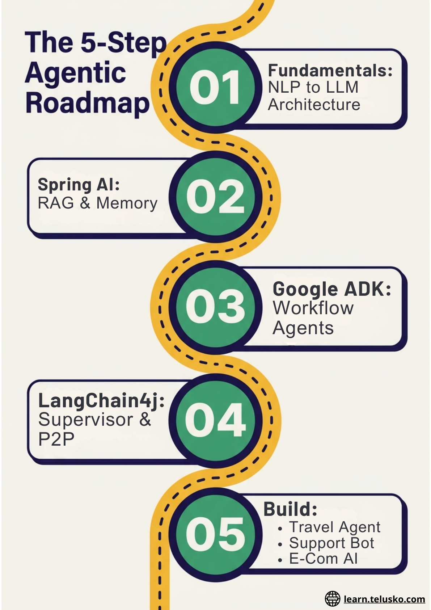 | **Type:** Architecture  learn.telusko.com ### Spring Al: RAG & Memory ### Fundamentals: NLP to LLM ### Architecture Google ADK: ### Workflow ### Agents Lang Chain4j: ### Supervisor & ### P2P ### Build: ### Travel Agent ### Support Bot E-Com AI  **Diagram:** [View Mermaid Diagram](diagrams/slide-002.mmd) |
| 3 |  | **Type:** Architecture  learn.telusko.com 01 Step 01: Lay the ### Neural Foundation NLP Fundamentals ### Transformers LLMs in Java ### Deep Learning What is NLP and why it matters for AI engineers Core NLP tasks: Tokenization, POS Tagging, NER Sentiment analysis and text classification Word2Vec and Glo Ve: pre-transformer embeddings From classical NLP to Deep Learning to LLMs Transformer architecture: encoder and decoder BERT vs GPT: bidirectional vs autoregressive Multi-head attention and positional encoding LLMs: Types, Tokens and ### Limitations Hallucination: why it happens and how to reduce it API vs SDK vs Framework: which to pick Open AI REST API calls directly from Java Official Open AI Java SDK walkthrough Hugging Face integration with Spring AI Building your first AI-powered Java app AI / ML / DL hierarchy explained Neural network fundamentals: weights, layers, activation Attention mechanism deep dive Why deep learning replaced classical NLP approaches  **Diagram:** [View Mermaid Diagram](diagrams/slide-003.mmd) |
| 4 |  | **Type:** Content  learn.telusko.com Step 02: Spring AI |
| 5 | 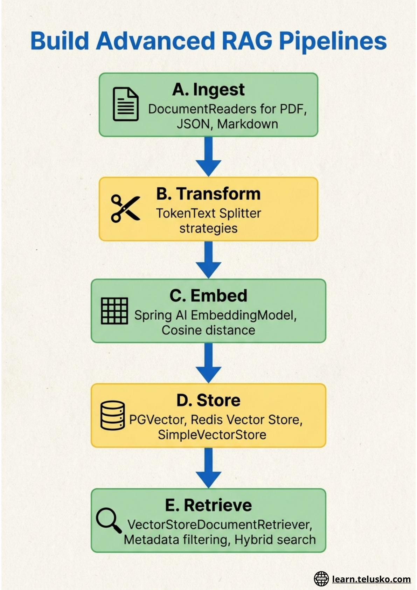 | **Type:** Content  learn.telusko.com |
| 6 |  | **Type:** Content  learn.telusko.com 03 Step 03: Google ADK |
| 7 | 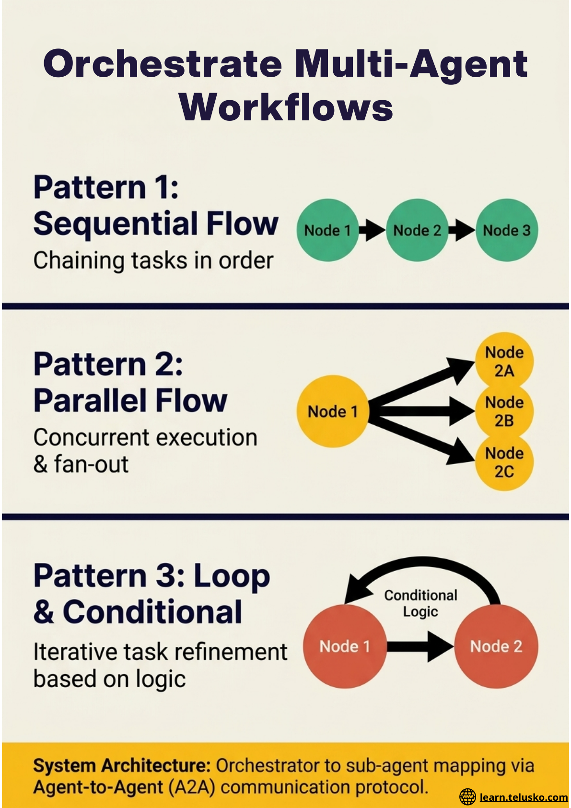 | **Type:** Workflow  learn.telusko.com ### Orchestrate Multi-Agent ### Workflows  **Diagram:** [View Mermaid Diagram](diagrams/slide-007.mmd) |
| 8 | 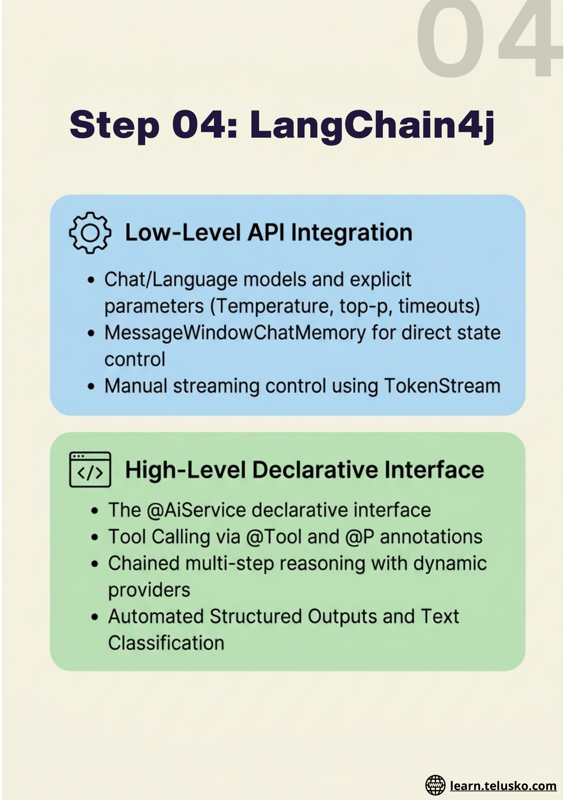 | **Type:** Content  learn.telusko.com 04 Step 04: Lang Chain4j |
| 9 |  | **Type:** Content  learn.telusko.com |
| 10 |  | **Type:** Content  learn.telusko.com |
| 11 |  | **Type:** Content  learn.telusko.com 05 ### Step 05: Build ### Autonomous Systems |
| 12 | 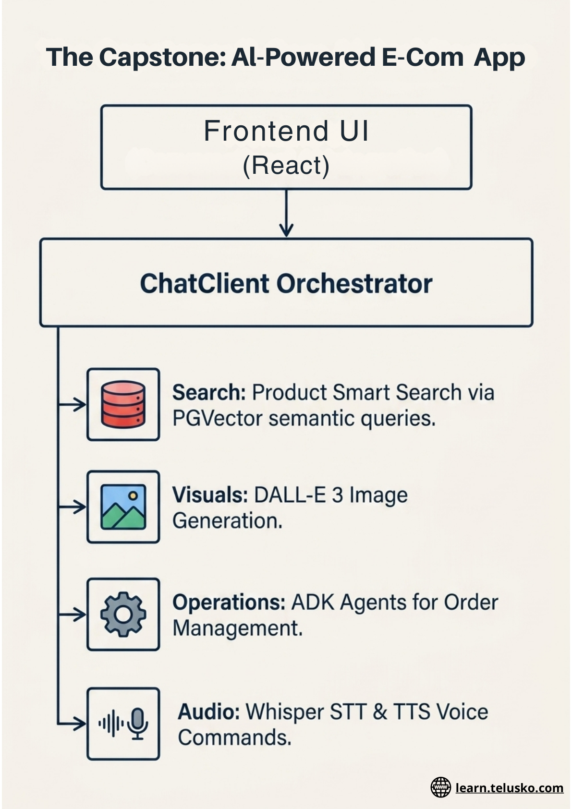 | **Type:** Content  learn.telusko.com #### The Capstone: Al-Powered E-Com  App Frontend UI ### (React) |
| 13 | 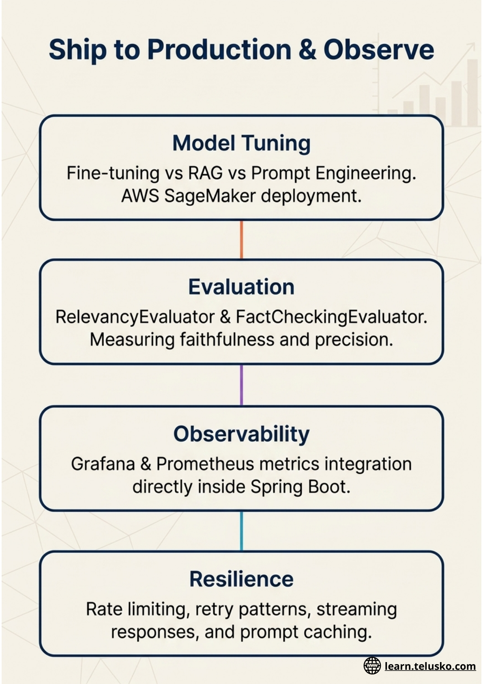 | **Type:** Content  learn.telusko.com |
| 14 |  | **Type:** Content  ### HYDER ABBAS ### NAVIN REDDY learn.telusko.com |
| 15 | 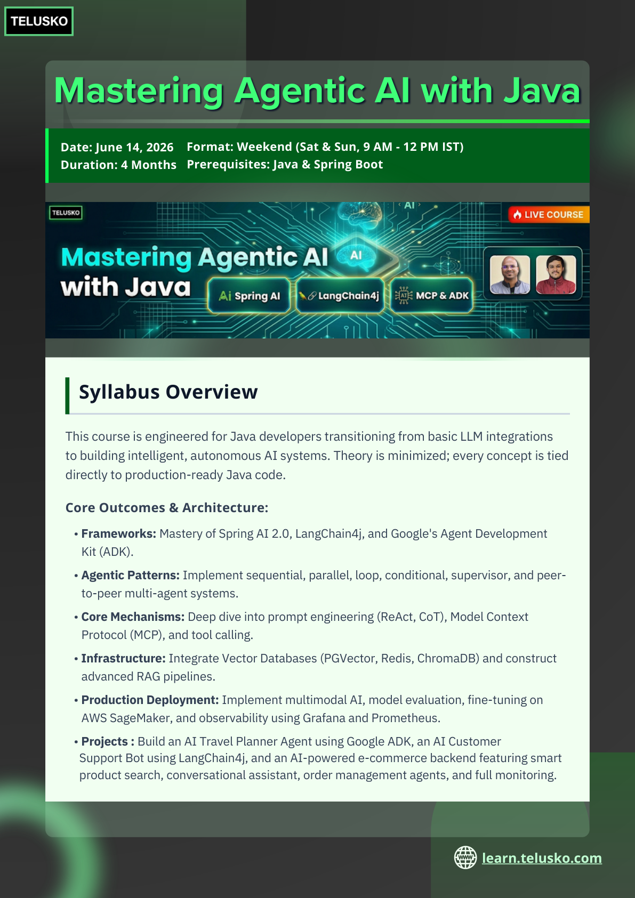 | **Type:** Agenda  ### Date: June 14, 2026 ### Duration: 4 Months #### Prerequisites: Java & Spring Boot Format: Weekend (Sat & Sun, 9 AM - 12 PM IST) ### Syllabus Overview This course is engineered for Java developers transitioning from basic LLM integrations to building intelligent, autonomous AI systems. Theory is minimized; every concept is tied directly to production-ready Java code. ### Core Outcomes & Architecture: - Frameworks: Mastery of Spring AI 2.0, Lang Chain4j, and Google's Agent Development Kit (ADK). - Agentic Patterns: Implement sequential, parallel, loop, conditional, supervisor, and peer- to-peer multi-agent systems. - Core Mechanisms: Deep dive into prompt engineering (Re Act, Co T), Model Context Protocol (MCP), and tool calling. - Infrastructure: Integrate Vector Databases (PGVector, Redis, Chroma DB) and construct advanced RAG pipelines. - Production Deployment: Implement multimodal AI, model evaluation, fine-tuning on AWS Sage Maker, and observability using Grafana and Prometheus. - Projects : Build an AI Travel Planner Agent using Google ADK, an AI Customer Support Bot using Lang Chain4j, and an AI-powered e-commerce backend featuring smart product search, conversational assistant, order management agents, and full monitoring. Mastering Agentic AI with Java Mastering Agentic AI with Java learn.telusko.com  **Diagram:** [View Mermaid Diagram](diagrams/slide-015.mmd) |
| 16 | 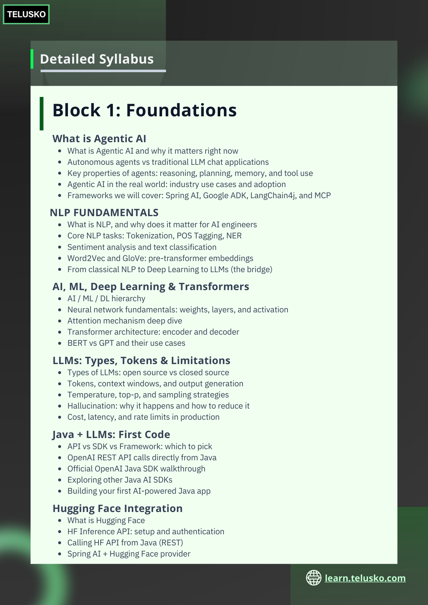 | **Type:** Architecture  ### Block 1: Foundations ### NLP FUNDAMENTALS What is NLP, and why does it matter for AI engineers Core NLP tasks: Tokenization, POS Tagging, NER Sentiment analysis and text classification Word2Vec and Glo Ve: pre-transformer embeddings From classical NLP to Deep Learning to LLMs (the bridge) What is Agentic AI What is Agentic AI and why it matters right now Autonomous agents vs traditional LLM chat applications Key properties of agents: reasoning, planning, memory, and tool use Agentic AI in the real world: industry use cases and adoption Frameworks we will cover: Spring AI, Google ADK, Lang Chain4j, and MCP AI, ML, Deep Learning & Transformers AI / ML / DL hierarchy Neural network fundamentals: weights, layers, and activation Attention mechanism deep dive Transformer architecture: encoder and decoder BERT vs GPT and their use cases LLMs: Types, Tokens & Limitations Types of LLMs: open source vs closed source Tokens, context windows, and output generation Temperature, top-p, and sampling strategies Hallucination: why it happens and how to reduce it Cost, latency, and rate limits in production Java + LLMs: First Code API vs SDK vs Framework: which to pick Open AI REST API calls directly from Java Official Open AI Java SDK walkthrough Exploring other Java AI SDKs Building your first AI-powered Java app ### Hugging Face Integration What is Hugging Face HF Inference API: setup and authentication Calling HF API from Java (REST) Spring AI + Hugging Face provider ### Detailed Syllabus learn.telusko.com  **Diagram:** [View Mermaid Diagram](diagrams/slide-016.mmd) |
| 17 | 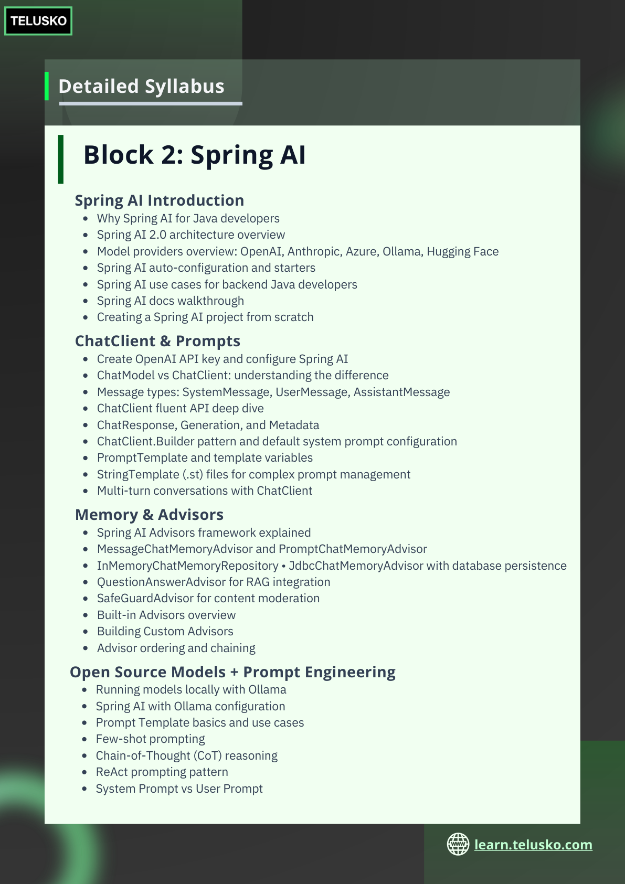 | **Type:** Title Slide  Block 2: Spring AI Spring AI Introduction Why Spring AI for Java developers Spring AI 2.0 architecture overview Model providers overview: Open AI, Anthropic, Azure, Ollama, Hugging Face Spring AI auto-configuration and starters Spring AI use cases for backend Java developers Spring AI docs walkthrough Creating a Spring AI project from scratch ### Chat Client & Prompts ### Memory & Advisors #### Open Source Models + Prompt Engineering Create Open AI API key and configure Spring AI Chat Model vs Chat Client: understanding the difference Message types: System Message, User Message, Assistant Message Chat Client fluent API deep dive Chat Response, Generation, and Metadata Chat Client.Builder pattern and default system prompt configuration Prompt Template and template variables String Template (.st) files for complex prompt management Multi-turn conversations with Chat Client Spring AI Advisors framework explained Message Chat Memory Advisor and Prompt Chat Memory Advisor In Memory Chat Memory Repository • Jdbc Chat Memory Advisor with database persistence Question Answer Advisor for RAG integration Safe Guard Advisor for content moderation Built-in Advisors overview ### Building Custom Advisors Advisor ordering and chaining Running models locally with Ollama Spring AI with Ollama configuration Prompt Template basics and use cases Few-shot prompting Chain-of-Thought (Co T) reasoning Re Act prompting pattern System Prompt vs User Prompt ### Detailed Syllabus learn.telusko.com  **Diagram:** [View Mermaid Diagram](diagrams/slide-017.mmd) |
| 18 | 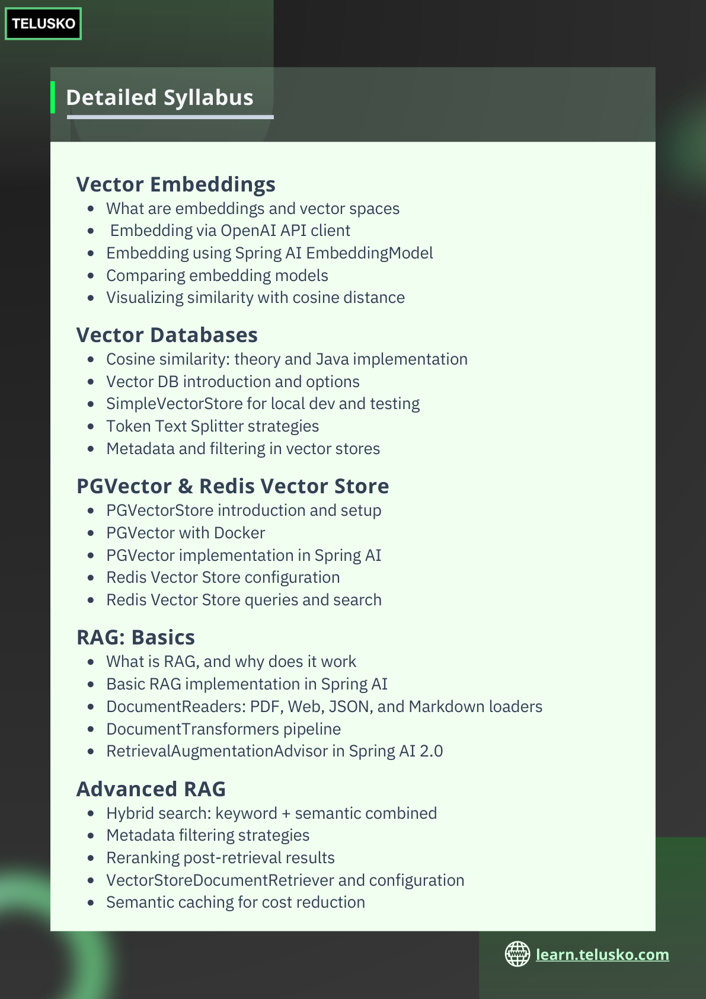 | **Type:** Code  ### Vector Embeddings What are embeddings and vector spaces Embedding via Open AI API client Embedding using Spring AI Embedding Model Comparing embedding models Visualizing similarity with cosine distance ### Vector Databases PGVector & Redis Vector Store RAG: Basics Advanced RAG Cosine similarity: theory and Java implementation Vector DB introduction and options Simple Vector Store for local dev and testing Token Text Splitter strategies Metadata and filtering in vector stores PGVector Store introduction and setup PGVector with Docker PGVector implementation in Spring AI Redis Vector Store configuration Redis Vector Store queries and search What is RAG, and why does it work Basic RAG implementation in Spring AI Document Readers: PDF, Web, JSON, and Markdown loaders Document Transformers pipeline Retrieval Augmentation Advisor in Spring AI 2.0 Hybrid search: keyword + semantic combined Metadata filtering strategies Reranking post-retrieval results Vector Store Document Retriever and configuration Semantic caching for cost reduction ### Detailed Syllabus learn.telusko.com |
| 19 | 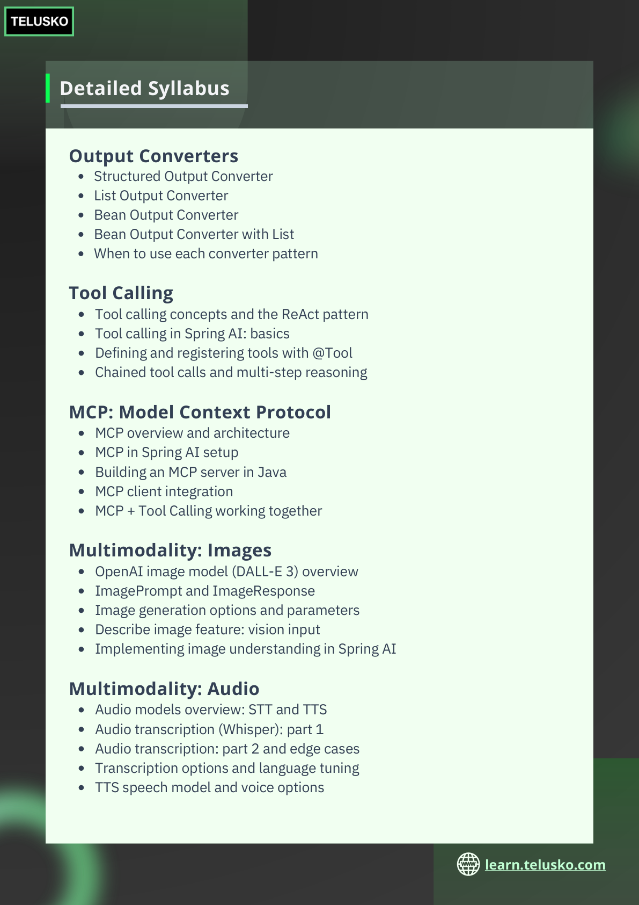 | **Type:** Agenda  ### Tool Calling Tool calling concepts and the Re Act pattern Tool calling in Spring AI: basics Defining and registering tools with @Tool Chained tool calls and multi-step reasoning MCP: Model Context Protocol MCP overview and architecture MCP in Spring AI setup Building an MCP server in Java MCP client integration MCP + Tool Calling working together ### Multimodality: Images Open AI image model (DALL-E 3) overview Image Prompt and Image Response Image generation options and parameters Describe image feature: vision input Implementing image understanding in Spring AI ### Multimodality: Audio Audio models overview: STT and TTS Audio transcription (Whisper): part 1 Audio transcription: part 2 and edge cases Transcription options and language tuning TTS speech model and voice options ### Detailed Syllabus ### Output Converters ### Structured Output Converter ### List Output Converter ### Bean Output Converter Bean Output Converter with List When to use each converter pattern learn.telusko.com  **Diagram:** [View Mermaid Diagram](diagrams/slide-019.mmd) |
| 20 | 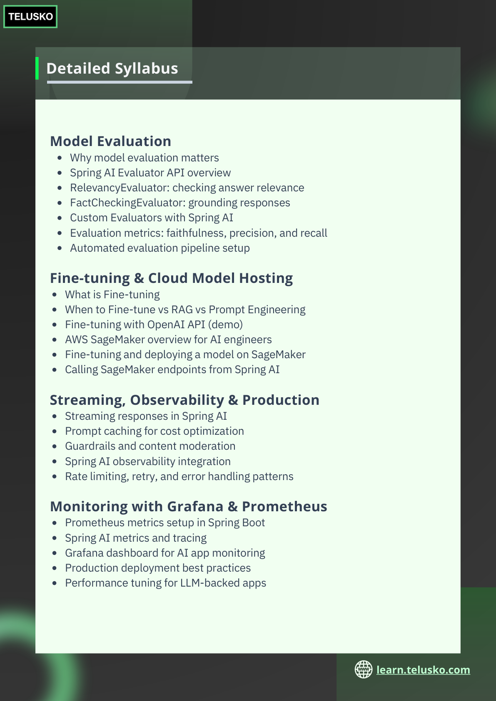 | **Type:** Agenda  Fine-tuning & Cloud Model Hosting #### Streaming, Observability & Production Monitoring with Grafana & Prometheus What is Fine-tuning When to Fine-tune vs RAG vs Prompt Engineering Fine-tuning with Open AI API (demo) AWS Sage Maker overview for AI engineers Fine-tuning and deploying a model on Sage Maker Calling Sage Maker endpoints from Spring AI Streaming responses in Spring AI Prompt caching for cost optimization Guardrails and content moderation Spring AI observability integration Rate limiting, retry, and error handling patterns Prometheus metrics setup in Spring Boot Spring AI metrics and tracing Grafana dashboard for AI app monitoring Production deployment best practices Performance tuning for LLM-backed apps ### Detailed Syllabus ### Model Evaluation Why model evaluation matters Spring AI Evaluator API overview Relevancy Evaluator: checking answer relevance Fact Checking Evaluator: grounding responses Custom Evaluators with Spring AI Evaluation metrics: faithfulness, precision, and recall Automated evaluation pipeline setup learn.telusko.com |
| 21 | 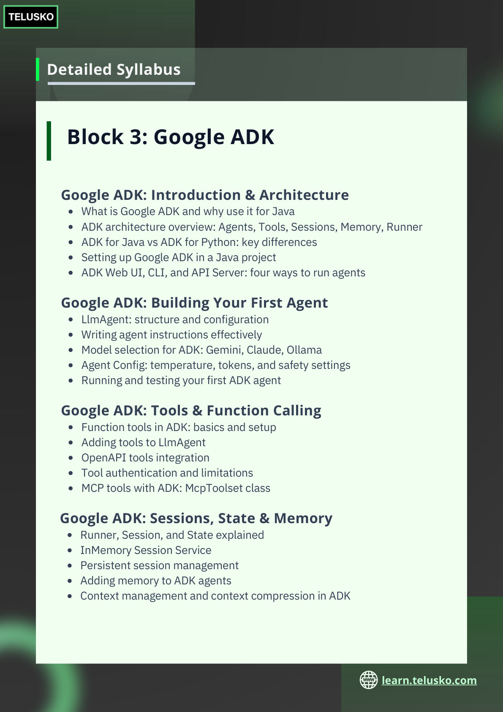 | **Type:** Title Slide  Block 3: Google ADK Google ADK: Introduction & Architecture What is Google ADK and why use it for Java ADK architecture overview: Agents, Tools, Sessions, Memory, Runner ADK for Java vs ADK for Python: key differences Setting up Google ADK in a Java project ADK Web UI, CLI, and API Server: four ways to run agents Google ADK: Building Your First Agent Google ADK: Tools & Function Calling Google ADK: Sessions, State & Memory Llm Agent: structure and configuration Writing agent instructions effectively Model selection for ADK: Gemini, Claude, Ollama Agent Config: temperature, tokens, and safety settings Running and testing your first ADK agent Function tools in ADK: basics and setup Adding tools to Llm Agent Open API tools integration Tool authentication and limitations MCP tools with ADK: Mcp Toolset class Runner, Session, and State explained ### In Memory Session Service Persistent session management Adding memory to ADK agents Context management and context compression in ADK ### Detailed Syllabus learn.telusko.com  **Diagram:** [View Mermaid Diagram](diagrams/slide-021.mmd) |
| 22 |  | **Type:** Agenda  Google ADK: Workflow Agents Sequential agents: chaining tasks in order Parallel agents: concurrent execution Loop agents: iterative task refinement Custom agents: building your own agent logic Agent routing and conditional flows Human-in-the-Loop (HITL) Workflows Google ADK: Multi-Agent Systems Google ADK: Callbacks, Artifacts & Guardrails Google ADK: Observability & Deployment Multi-agent architecture overview Orchestrator and sub-agent patterns Agent-to-Agent (A2A) communication protocol A2A in Java: exposing and consuming agents Debugging and tracing multi-agent flows Callbacks: before and after model and tool execution Callback design patterns and best practices Artifacts: managing files and binary outputs Implement guardrails and safety settings Grounding with Google Search and Vertex AI Observability: logging, metrics, and traces Evaluating ADK agents: criteria and custom metrics Deploying agents to Cloud Run using ADK command Deploying agents to GKE with Docker Production best practices for ADK agents ### Detailed Syllabus learn.telusko.com  **Diagram:** [View Mermaid Diagram](diagrams/slide-022.mmd) |
| 23 |  | **Type:** Title Slide  Block 4: Lang Chain4j Lang Chain4j: Introduction Lang Chain4j: AI Services, Memory & Streaming Lang Chain4j: Tool Calling Lang Chain4j: MCP What is Lang Chain4j, and why use it Lang Chain4j vs Spring AI: when to pick which Setting up Lang Chain4j in a Spring Boot project Chat and Language Models low-level API Model parameters: temperature, top-p, timeouts First chatbot with Lang Chain4j AI Services and declarative interface with @Ai Service Chat Memory: Message Window Chat Memory and Token Window Chat Memory Conversation Memory and memory providers Streaming responses with Token Stream Structured Outputs in Lang Chain4j Text Classification with AI Services Guardrails: input and output validation Logging and Observability in Lang Chain4j Tool calling concepts in Lang Chain4j @Tool and @P annotations Chained tool calls and multi-step reasoning Tool calling with AI Services Dynamic tool providers MCP overview in Lang Chain4j context MCP client setup in Lang Chain4j Building a Java MCP stdio server Connecting MCP server to AI Services MCP + Tool Calling working together ### Detailed Syllabus learn.telusko.com |
| 24 | 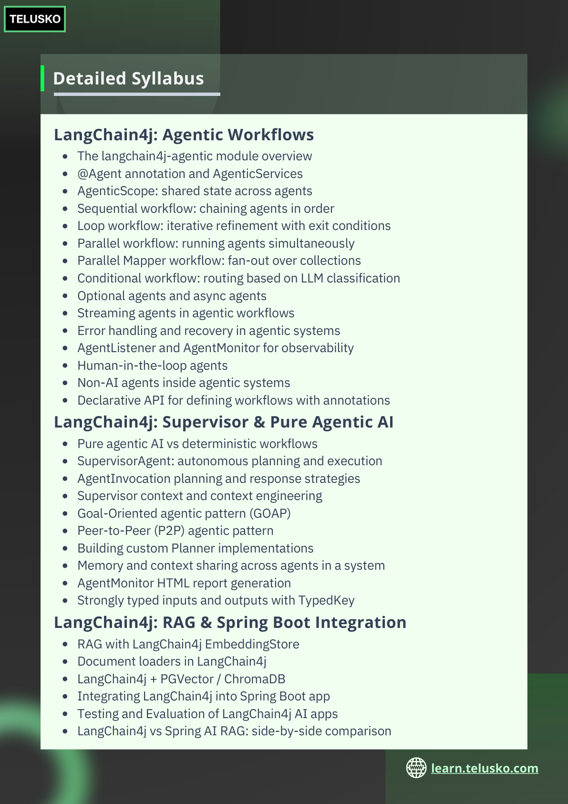 | **Type:** Agenda  Lang Chain4j: Agentic Workflows Lang Chain4j: Supervisor & Pure Agentic AI Lang Chain4j: RAG & Spring Boot Integration The langchain4j-agentic module overview @Agent annotation and Agentic Services Agentic Scope: shared state across agents Sequential workflow: chaining agents in order Loop workflow: iterative refinement with exit conditions Parallel workflow: running agents simultaneously Parallel Mapper workflow: fan-out over collections Conditional workflow: routing based on LLM classification Optional agents and async agents Streaming agents in agentic workflows Error handling and recovery in agentic systems Agent Listener and Agent Monitor for observability Human-in-the-loop agents Non-AI agents inside agentic systems Declarative API for defining workflows with annotations Pure agentic AI vs deterministic workflows Supervisor Agent: autonomous planning and execution Agent Invocation planning and response strategies Supervisor context and context engineering Goal-Oriented agentic pattern (GOAP) Peer-to-Peer (P2P) agentic pattern Building custom Planner implementations Memory and context sharing across agents in a system Agent Monitor HTML report generation Strongly typed inputs and outputs with Typed Key RAG with Lang Chain4j Embedding Store Document loaders in Lang Chain4j Lang Chain4j + PGVector / Chroma DB Integrating Lang Chain4j into Spring Boot app Testing and Evaluation of Lang Chain4j AI apps Lang Chain4j vs Spring AI RAG: side-by-side comparison ### Detailed Syllabus learn.telusko.com  **Diagram:** [View Mermaid Diagram](diagrams/slide-024.mmd) |
| 25 | 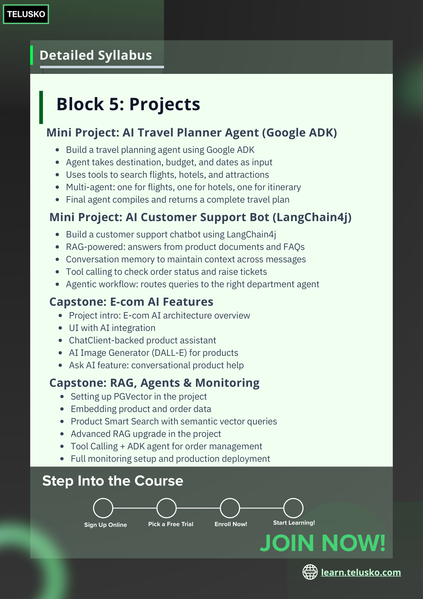 | **Type:** Agenda  ### Block 5: Projects Capstone: E-com AI Features Project intro: E-com AI architecture overview UI with AI integration Chat Client-backed product assistant AI Image Generator (DALL-E) for products Ask AI feature: conversational product help Mini Project: AI Travel Planner Agent (Google ADK) Build a travel planning agent using Google ADK Agent takes destination, budget, and dates as input Uses tools to search flights, hotels, and attractions Multi-agent: one for flights, one for hotels, one for itinerary Final agent compiles and returns a complete travel plan Mini Project: AI Customer Support Bot (Lang Chain4j) Build a customer support chatbot using Lang Chain4j RAG-powered: answers from product documents and FAQs Conversation memory to maintain context across messages Tool calling to check order status and raise tickets Agentic workflow: routes queries to the right department agent Capstone: RAG, Agents & Monitoring Setting up PGVector in the project Embedding product and order data Product Smart Search with semantic vector queries Advanced RAG upgrade in the project Tool Calling + ADK agent for order management Full monitoring setup and production deployment learn.telusko.com ### Detailed Syllabus Step Into the Course ### Sign Up Online Pick a Free Trial ### Enroll Now! ### Start Learning! ### JOIN NOW!  **Diagram:** [View Mermaid Diagram](diagrams/slide-025.mmd) |