# Mastering Agentic AI with Java - Slide Extraction


---

# Slide 1

| Image |
|---|

| 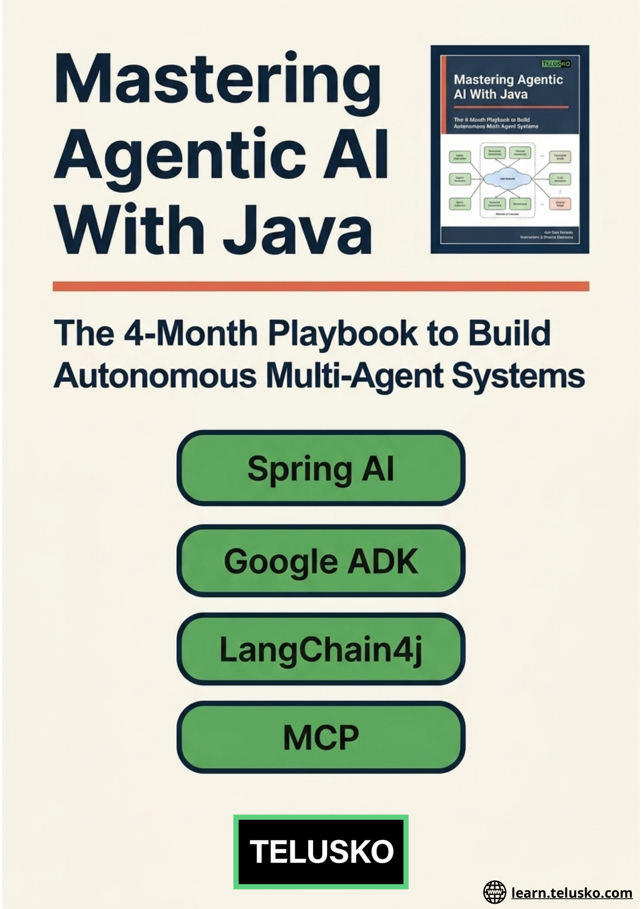 |


## Text Content


```
learn.telusko.com
```


---

# Slide 2

| Image |
|---|

|  |


## Text Content


```
learn.telusko.com
Spring Al:
RAG & Memory
Fundamentals:
NLP to LLM
Architecture
Google ADK:
Workflow
Agents
LangChain4j:
Supervisor &
P2P
Build:
Travel Agent
Support Bot 
E-Com AI
```


---

# Slide 3

| Image |
|---|

| 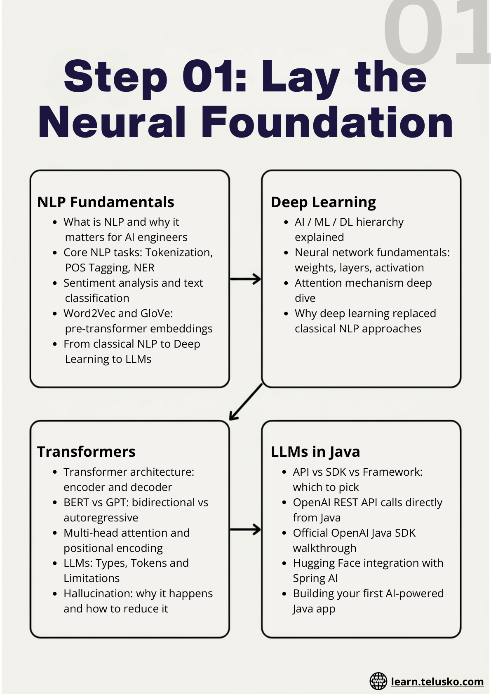 |


## Text Content


```
learn.telusko.com
01
Step 01: Lay the
Neural Foundation
NLP Fundamentals
Transformers
LLMs in Java
Deep Learning
What is NLP and why it
       matters for AI engineers
Core NLP tasks: Tokenization,
       POS Tagging, NER
Sentiment analysis and text
       classification
Word2Vec and GloVe:
       pre-transformer embeddings
From classical NLP to Deep
       Learning to LLMs
Transformer architecture:
encoder and decoder
BERT vs GPT: bidirectional vs
autoregressive
Multi-head attention and
positional encoding
LLMs: Types, Tokens and
Limitations
Hallucination: why it happens
and how to reduce it
API vs SDK vs Framework:
which to pick
OpenAI REST API calls directly
from Java
Official OpenAI Java SDK
walkthrough
Hugging Face integration with
Spring AI
Building your first AI-powered
Java app
AI / ML / DL hierarchy
explained
Neural network fundamentals:
weights, layers, activation
Attention mechanism deep
dive
Why deep learning replaced
classical NLP approaches
```


---

# Slide 4

| Image |
|---|

| 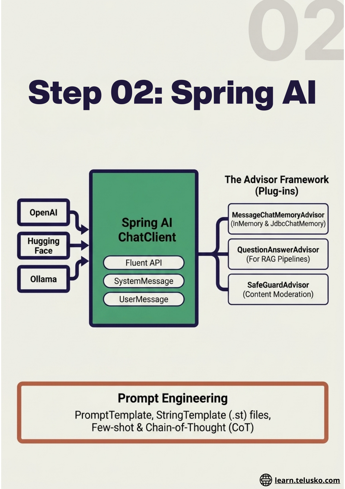 |


## Text Content


```
learn.telusko.com
Step 02: Spring AI
```


---

# Slide 5

| Image |
|---|

|  |


## Text Content


```
learn.telusko.com
```


---

# Slide 6

| Image |
|---|

| 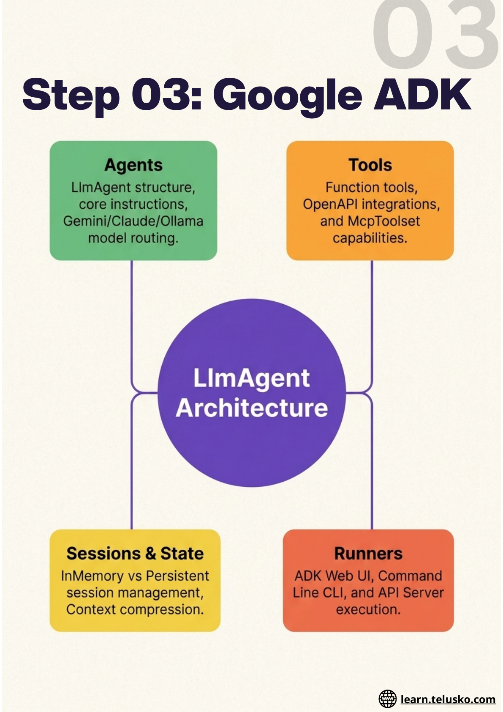 |


## Text Content


```
learn.telusko.com
03
Step 03: Google ADK
```


---

# Slide 7

| Image |
|---|

| 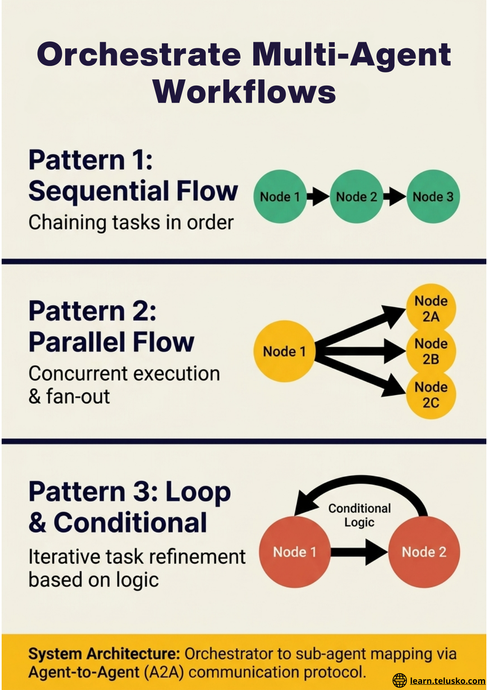 |


## Text Content


```
learn.telusko.com
Orchestrate Multi-Agent
Workflows
```


---

# Slide 8

| Image |
|---|

| 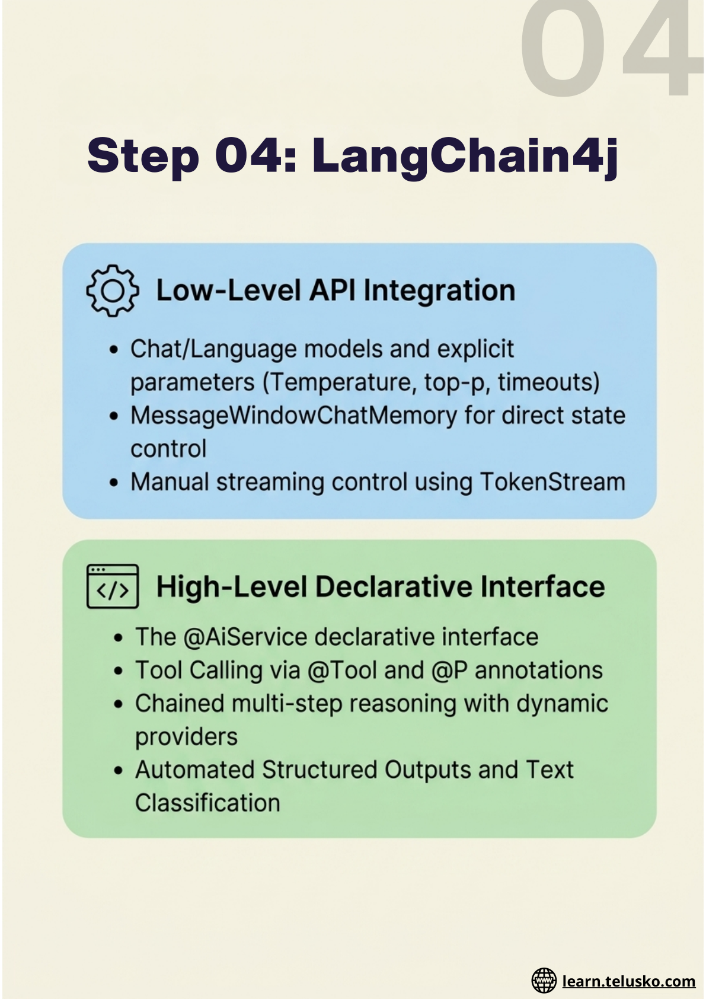 |


## Text Content


```
learn.telusko.com
04
Step 04: LangChain4j
```


---

# Slide 9

| Image |
|---|

| 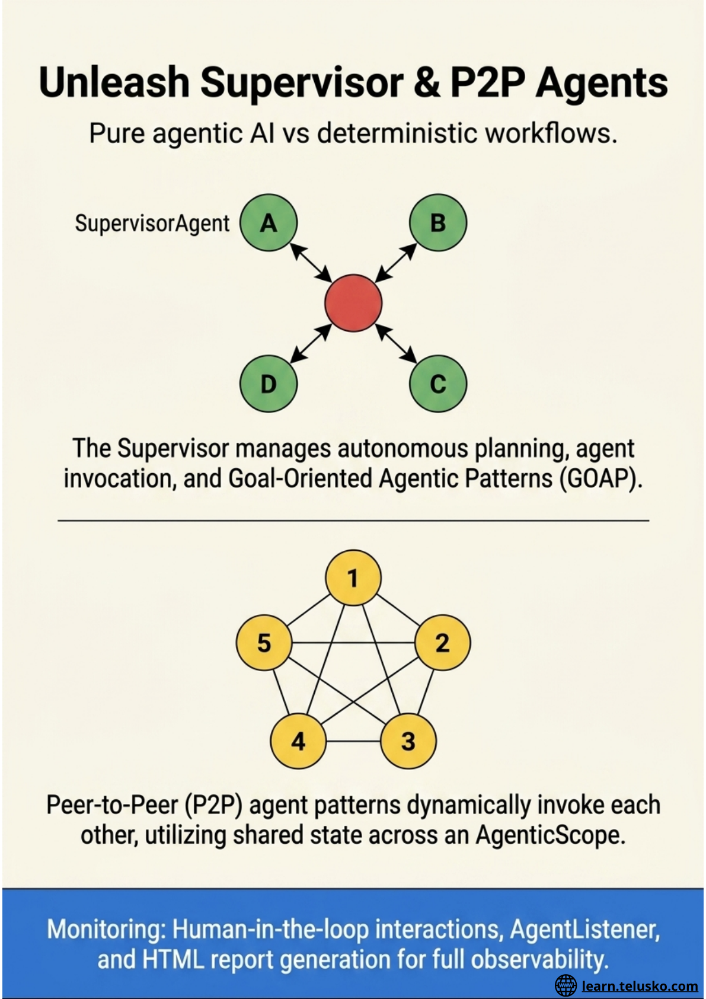 |


## Text Content


```
learn.telusko.com
```


---

# Slide 10

| Image |
|---|

| 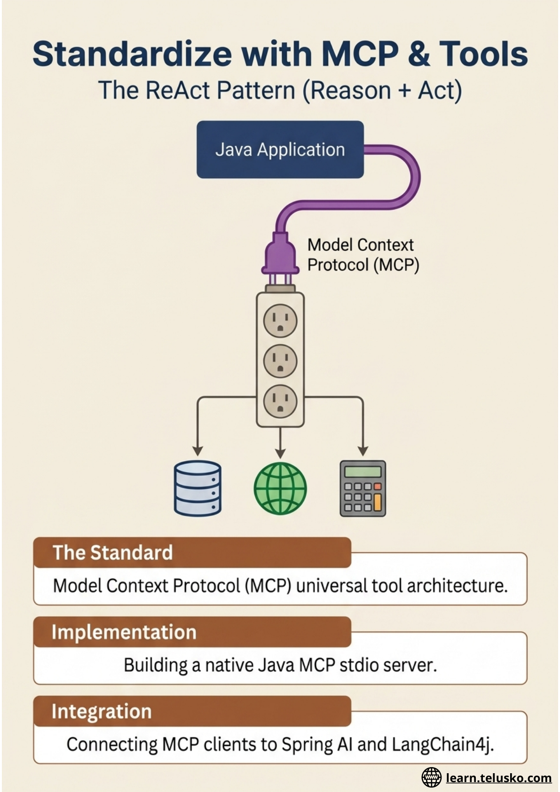 |


## Text Content


```
learn.telusko.com
```


---

# Slide 11

| Image |
|---|

| 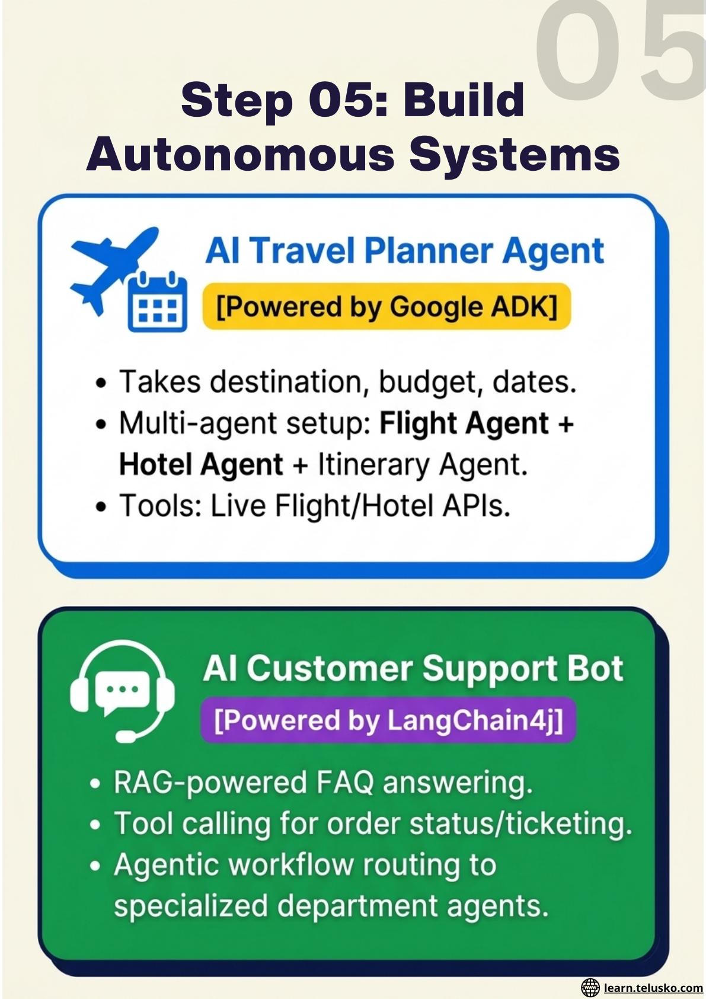 |


## Text Content


```
learn.telusko.com
05
Step 05: Build
Autonomous Systems
```


---

# Slide 12

| Image |
|---|

|  |


## Text Content


```
learn.telusko.com
The Capstone: Al-Powered E-Com  App
Frontend UI
(React)
```


---

# Slide 13

| Image |
|---|

|  |


## Text Content


```
learn.telusko.com
```


---

# Slide 14

| Image |
|---|

| 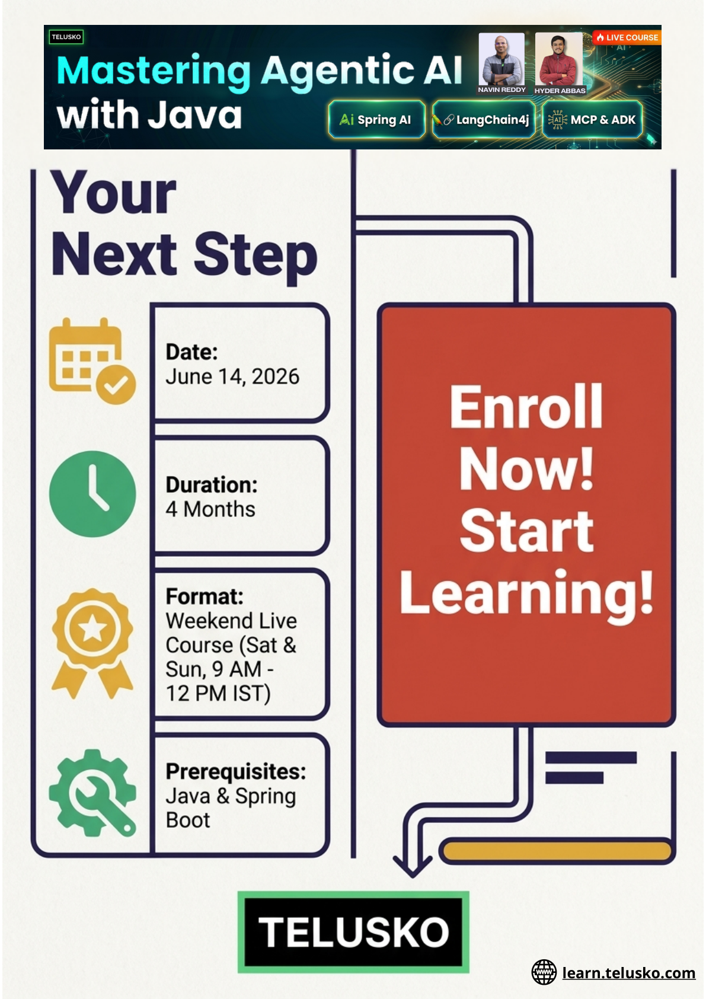 |


## Text Content


```
HYDER ABBAS
NAVIN REDDY
learn.telusko.com
```


---

# Slide 15

| Image |
|---|

| 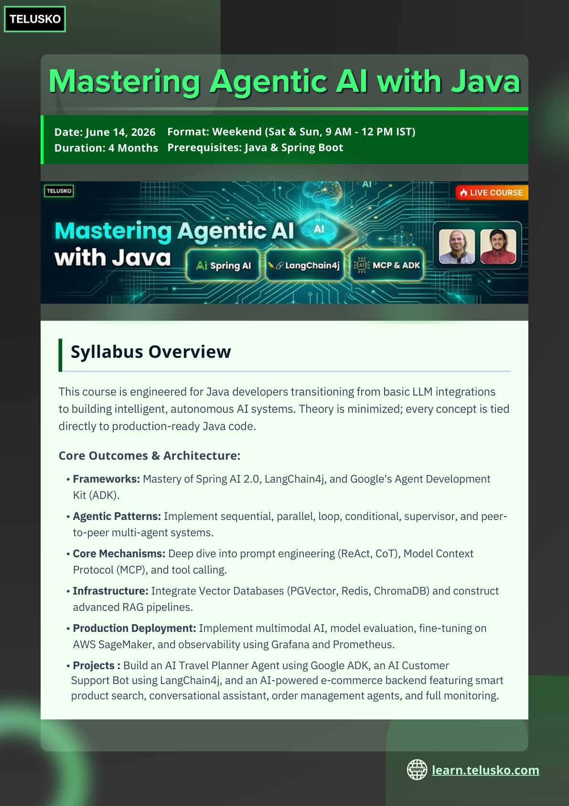 |


## Text Content


```
Date: June 14, 2026
Duration: 4 Months
Prerequisites: Java & Spring Boot
Format: Weekend (Sat & Sun, 9 AM - 12 PM IST)
Syllabus Overview
This course is engineered for Java developers transitioning from basic LLM integrations
to building intelligent, autonomous AI systems. Theory is minimized; every concept is tied
directly to production-ready Java code.
Core Outcomes & Architecture:
• Frameworks: Mastery of Spring AI 2.0, LangChain4j, and Google's Agent Development
Kit (ADK).
• Agentic Patterns: Implement sequential, parallel, loop, conditional, supervisor, and peer-
to-peer multi-agent systems.
• Core Mechanisms: Deep dive into prompt engineering (ReAct, CoT), Model Context
Protocol (MCP), and tool calling.
• Infrastructure: Integrate Vector Databases (PGVector, Redis, ChromaDB) and construct
advanced RAG pipelines.
• Production Deployment: Implement multimodal AI, model evaluation, fine-tuning on
AWS SageMaker, and observability using Grafana and Prometheus.
• Projects : Build an AI Travel Planner Agent using Google ADK, an AI Customer   
  Support Bot using LangChain4j, and an AI-powered e-commerce backend featuring smart 
  product search, conversational assistant, order management agents, and full monitoring.
Mastering Agentic AI with Java
Mastering Agentic AI with Java
learn.telusko.com
```


---

# Slide 16

| Image |
|---|

|  |


## Text Content


```
Block 1: Foundations
NLP FUNDAMENTALS 
What is NLP, and why does it matter for AI engineers 
Core NLP tasks: Tokenization, POS Tagging, NER
Sentiment analysis and text classification
Word2Vec and GloVe: pre-transformer embeddings
From classical NLP to Deep Learning to LLMs (the bridge)
 What is Agentic AI 
What is Agentic AI and why it matters right now 
Autonomous agents vs traditional LLM chat applications 
Key properties of agents: reasoning, planning, memory, and tool use 
Agentic AI in the real world: industry use cases and adoption 
Frameworks we will cover: Spring AI, Google ADK, LangChain4j, and MCP
 AI, ML, Deep Learning & Transformers 
AI / ML / DL hierarchy
Neural network fundamentals: weights, layers, and activation 
Attention mechanism deep dive
Transformer architecture: encoder and decoder
BERT vs GPT and their use cases 
 LLMs: Types, Tokens & Limitations 
Types of LLMs: open source vs closed source
Tokens, context windows, and output generation 
Temperature, top-p, and sampling strategies
Hallucination: why it happens and how to reduce it
Cost, latency, and rate limits in production
 Java + LLMs: First Code 
API vs SDK vs Framework: which to pick
OpenAI REST API calls directly from Java 
Official OpenAI Java SDK walkthrough
Exploring other Java AI SDKs
Building your first AI-powered Java app
 Hugging Face Integration 
What is Hugging Face 
HF Inference API: setup and authentication
Calling HF API from Java (REST)
Spring AI + Hugging Face provider
Detailed Syllabus
learn.telusko.com
```


---

# Slide 17

| Image |
|---|

|  |


## Text Content


```
Block 2: Spring AI 
 Spring AI Introduction 
Why Spring AI for Java developers 
Spring AI 2.0 architecture overview 
Model providers overview: OpenAI, Anthropic, Azure, Ollama, Hugging Face 
Spring AI auto-configuration and starters 
Spring AI use cases for backend Java developers 
Spring AI docs walkthrough 
Creating a Spring AI project from scratch
 ChatClient & Prompts 
 Memory & Advisors 
Open Source Models + Prompt Engineering 
Create OpenAI API key and configure Spring AI 
ChatModel vs ChatClient: understanding the difference 
Message types: SystemMessage, UserMessage, AssistantMessage 
ChatClient fluent API deep dive 
ChatResponse, Generation, and Metadata 
ChatClient.Builder pattern and default system prompt configuration 
PromptTemplate and template variables 
StringTemplate (.st) files for complex prompt management 
Multi-turn conversations with ChatClient 
Spring AI Advisors framework explained 
MessageChatMemoryAdvisor and PromptChatMemoryAdvisor 
InMemoryChatMemoryRepository • JdbcChatMemoryAdvisor with database persistence 
QuestionAnswerAdvisor for RAG integration 
SafeGuardAdvisor for content moderation 
Built-in Advisors overview 
Building Custom Advisors 
Advisor ordering and chaining
Running models locally with Ollama 
Spring AI with Ollama configuration 
Prompt Template basics and use cases 
Few-shot prompting 
Chain-of-Thought (CoT) reasoning 
ReAct prompting pattern 
System Prompt vs User Prompt
Detailed Syllabus
learn.telusko.com
```


---

# Slide 18

| Image |
|---|

|  |


## Text Content


```
Vector Embeddings 
What are embeddings and vector spaces
 Embedding via OpenAI API client 
Embedding using Spring AI EmbeddingModel 
Comparing embedding models 
Visualizing similarity with cosine distance 
 Vector Databases 
 PGVector & Redis Vector Store 
 RAG: Basics 
 Advanced RAG 
Cosine similarity: theory and Java implementation 
Vector DB introduction and options 
SimpleVectorStore for local dev and testing 
Token Text Splitter strategies 
Metadata and filtering in vector stores
PGVectorStore introduction and setup 
PGVector with Docker 
PGVector implementation in Spring AI 
Redis Vector Store configuration 
Redis Vector Store queries and search
What is RAG, and why does it work
Basic RAG implementation in Spring AI 
DocumentReaders: PDF, Web, JSON, and Markdown loaders 
DocumentTransformers pipeline 
RetrievalAugmentationAdvisor in Spring AI 2.0
Hybrid search: keyword + semantic combined 
Metadata filtering strategies 
Reranking post-retrieval results 
VectorStoreDocumentRetriever and configuration
Semantic caching for cost reduction
Detailed Syllabus
learn.telusko.com
```


---

# Slide 19

| Image |
|---|

|  |


## Text Content


```
Tool Calling 
Tool calling concepts and the ReAct pattern
Tool calling in Spring AI: basics 
Defining and registering tools with @Tool
Chained tool calls and multi-step reasoning
 MCP: Model Context Protocol 
MCP overview and architecture 
MCP in Spring AI setup 
Building an MCP server in Java 
MCP client integration
MCP + Tool Calling working together
 Multimodality: Images 
OpenAI image model (DALL-E 3) overview 
ImagePrompt and ImageResponse 
Image generation options and parameters 
Describe image feature: vision input 
Implementing image understanding in Spring AI 
 Multimodality: Audio 
Audio models overview: STT and TTS 
Audio transcription (Whisper): part 1 
Audio transcription: part 2 and edge cases 
Transcription options and language tuning 
TTS speech model and voice options
Detailed Syllabus
 Output Converters 
Structured Output Converter 
List Output Converter 
Bean Output Converter 
Bean Output Converter with List 
When to use each converter pattern
learn.telusko.com
```


---

# Slide 20

| Image |
|---|

|  |


## Text Content


```
Fine-tuning & Cloud Model Hosting 
 Streaming, Observability & Production 
 Monitoring with Grafana & Prometheus 
What is Fine-tuning 
When to Fine-tune vs RAG vs Prompt Engineering
Fine-tuning with OpenAI API (demo) 
AWS SageMaker overview for AI engineers 
Fine-tuning and deploying a model on SageMaker 
Calling SageMaker endpoints from Spring AI
Streaming responses in Spring AI 
Prompt caching for cost optimization 
Guardrails and content moderation 
Spring AI observability integration 
Rate limiting, retry, and error handling patterns
Prometheus metrics setup in Spring Boot 
Spring AI metrics and tracing 
Grafana dashboard for AI app monitoring 
Production deployment best practices 
Performance tuning for LLM-backed apps
Detailed Syllabus
 Model Evaluation 
Why model evaluation matters 
Spring AI Evaluator API overview 
RelevancyEvaluator: checking answer relevance 
FactCheckingEvaluator: grounding responses 
Custom Evaluators with Spring AI 
Evaluation metrics: faithfulness, precision, and recall 
Automated evaluation pipeline setup
learn.telusko.com
```


---

# Slide 21

| Image |
|---|

|  |


## Text Content


```
Block 3: Google ADK 
 Google ADK: Introduction & Architecture 
What is Google ADK and why use it for Java 
ADK architecture overview: Agents, Tools, Sessions, Memory, Runner 
ADK for Java vs ADK for Python: key differences 
Setting up Google ADK in a Java project 
ADK Web UI, CLI, and API Server: four ways to run agents
 Google ADK: Building Your First Agent 
 Google ADK: Tools & Function Calling 
 Google ADK: Sessions, State & Memory 
LlmAgent: structure and configuration 
Writing agent instructions effectively 
Model selection for ADK: Gemini, Claude, Ollama 
Agent Config: temperature, tokens, and safety settings 
Running and testing your first ADK agent 
Function tools in ADK: basics and setup 
Adding tools to LlmAgent 
OpenAPI tools integration 
Tool authentication and limitations 
MCP tools with ADK: McpToolset class
Runner, Session, and State explained 
InMemory Session Service 
Persistent session management 
Adding memory to ADK agents 
Context management and context compression in ADK
Detailed Syllabus
learn.telusko.com
```


---

# Slide 22

| Image |
|---|

| 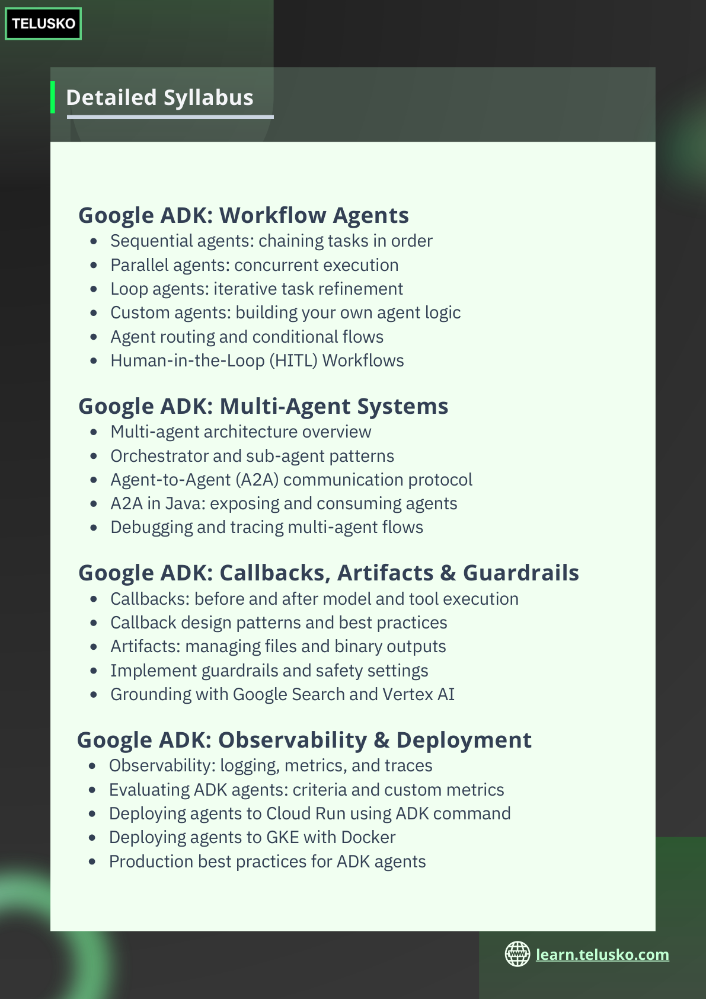 |


## Text Content


```
Google ADK: Workflow Agents 
Sequential agents: chaining tasks in order
Parallel agents: concurrent execution 
Loop agents: iterative task refinement 
Custom agents: building your own agent logic 
Agent routing and conditional flows
Human-in-the-Loop (HITL) Workflows
 Google ADK: Multi-Agent Systems 
 Google ADK: Callbacks, Artifacts & Guardrails 
 Google ADK: Observability & Deployment 
Multi-agent architecture overview 
Orchestrator and sub-agent patterns 
Agent-to-Agent (A2A) communication protocol 
A2A in Java: exposing and consuming agents 
Debugging and tracing multi-agent flows
Callbacks: before and after model and tool execution 
Callback design patterns and best practices 
Artifacts: managing files and binary outputs 
Implement guardrails and safety settings 
Grounding with Google Search and Vertex AI
Observability: logging, metrics, and traces 
Evaluating ADK agents: criteria and custom metrics 
Deploying agents to Cloud Run using ADK command 
Deploying agents to GKE with Docker 
Production best practices for ADK agents
Detailed Syllabus
learn.telusko.com
```


---

# Slide 23

| Image |
|---|

| 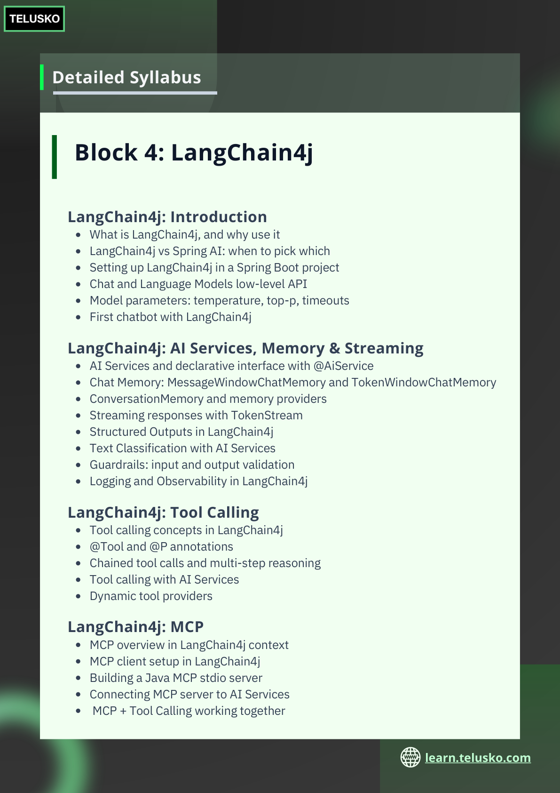 |


## Text Content


```
Block 4: LangChain4j 
 LangChain4j: Introduction 
 LangChain4j: AI Services, Memory & Streaming 
 LangChain4j: Tool Calling 
 LangChain4j: MCP 
What is LangChain4j, and why use it 
LangChain4j vs Spring AI: when to pick which 
Setting up LangChain4j in a Spring Boot project 
Chat and Language Models low-level API 
Model parameters: temperature, top-p, timeouts 
First chatbot with LangChain4j 
AI Services and declarative interface with @AiService 
Chat Memory: MessageWindowChatMemory and TokenWindowChatMemory 
ConversationMemory and memory providers 
Streaming responses with TokenStream 
Structured Outputs in LangChain4j 
Text Classification with AI Services 
Guardrails: input and output validation 
Logging and Observability in LangChain4j
Tool calling concepts in LangChain4j 
@Tool and @P annotations 
Chained tool calls and multi-step reasoning 
Tool calling with AI Services 
Dynamic tool providers
MCP overview in LangChain4j context 
MCP client setup in LangChain4j 
Building a Java MCP stdio server 
Connecting MCP server to AI Services
 MCP + Tool Calling working together
Detailed Syllabus
learn.telusko.com
```


---

# Slide 24

| Image |
|---|

|  |


## Text Content


```
LangChain4j: Agentic Workflows 
 LangChain4j: Supervisor & Pure Agentic AI 
 LangChain4j: RAG & Spring Boot Integration 
The langchain4j-agentic module overview 
@Agent annotation and AgenticServices 
AgenticScope: shared state across agents 
Sequential workflow: chaining agents in order 
Loop workflow: iterative refinement with exit conditions 
Parallel workflow: running agents simultaneously 
Parallel Mapper workflow: fan-out over collections 
Conditional workflow: routing based on LLM classification 
Optional agents and async agents 
Streaming agents in agentic workflows 
Error handling and recovery in agentic systems 
AgentListener and AgentMonitor for observability 
Human-in-the-loop agents 
Non-AI agents inside agentic systems 
Declarative API for defining workflows with annotations
Pure agentic AI vs deterministic workflows 
SupervisorAgent: autonomous planning and execution 
AgentInvocation planning and response strategies
Supervisor context and context engineering 
Goal-Oriented agentic pattern (GOAP) 
Peer-to-Peer (P2P) agentic pattern 
Building custom Planner implementations 
Memory and context sharing across agents in a system 
AgentMonitor HTML report generation 
Strongly typed inputs and outputs with TypedKey
RAG with LangChain4j EmbeddingStore 
Document loaders in LangChain4j 
LangChain4j + PGVector / ChromaDB 
Integrating LangChain4j into Spring Boot app 
Testing and Evaluation of LangChain4j AI apps 
LangChain4j vs Spring AI RAG: side-by-side comparison
Detailed Syllabus
learn.telusko.com
```


---

# Slide 25

| Image |
|---|

| 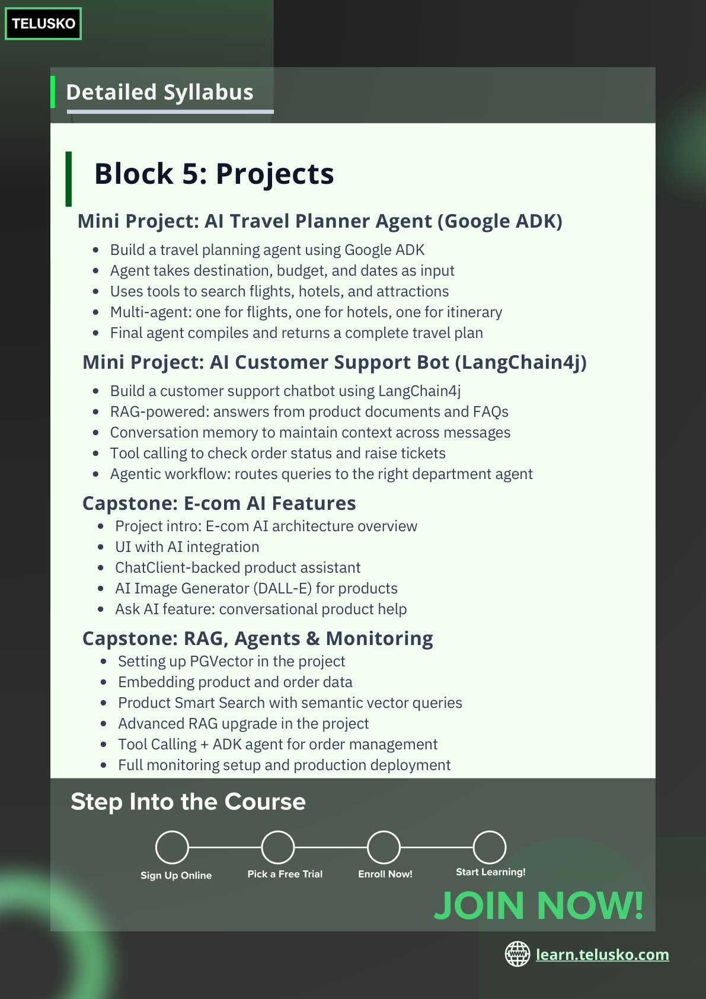 |


## Text Content


```
Block 5: Projects 
 Capstone: E-com AI Features 
Project intro: E-com AI architecture overview 
UI with AI integration 
ChatClient-backed product assistant 
AI Image Generator (DALL-E) for products 
Ask AI feature: conversational product help
Mini Project: AI Travel Planner Agent (Google ADK) 
Build a travel planning agent using Google ADK 
Agent takes destination, budget, and dates as input 
Uses tools to search flights, hotels, and attractions 
Multi-agent: one for flights, one for hotels, one for itinerary 
Final agent compiles and returns a complete travel plan 
 Mini Project: AI Customer Support Bot (LangChain4j) 
Build a customer support chatbot using LangChain4j 
RAG-powered: answers from product documents and FAQs 
Conversation memory to maintain context across messages 
Tool calling to check order status and raise tickets 
Agentic workflow: routes queries to the right department agent
 Capstone: RAG, Agents & Monitoring 
Setting up PGVector in the project 
Embedding product and order data 
Product Smart Search with semantic vector queries 
Advanced RAG upgrade in the project 
Tool Calling + ADK agent for order management 
Full monitoring setup and production deployment 
learn.telusko.com
Detailed Syllabus
Step Into the Course
Sign Up Online 
Pick a Free Trial
Enroll Now!
Start Learning!
JOIN NOW!
```
