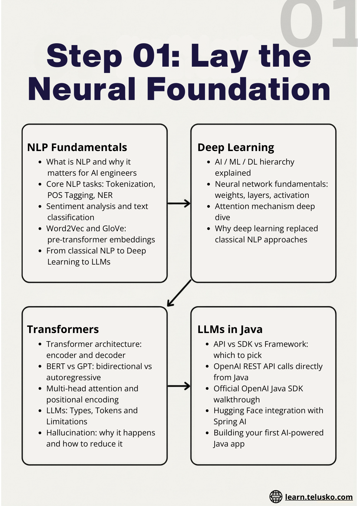
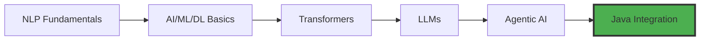

# Block 1: Foundations

## Overview

This foundational block introduces you to the core concepts of Natural Language Processing, Deep Learning, Transformers, and Large Language Models. You'll understand the evolution from classical NLP to modern LLMs and get hands-on experience integrating LLMs with Java.

## What You'll Learn

### Module 1.1: NLP Fundamentals
- What is NLP and why it matters for AI engineers
- Core NLP tasks: Tokenization, POS Tagging, NER
- Sentiment analysis and text classification
- Word2Vec and GloVe: pre-transformer embeddings
- From classical NLP to Deep Learning to LLMs

### Module 1.2: AI/ML/DL Hierarchy
- AI / ML / DL hierarchy explained
- Neural network fundamentals: weights, layers, activation
- Attention mechanism deep dive
- Why deep learning replaced classical NLP approaches

### Module 1.3: Transformers & Attention
- Transformer architecture: encoder and decoder
- BERT vs GPT: bidirectional vs autoregressive
- Multi-head attention and positional encoding

### Module 1.4: LLMs: Types, Tokens & Limitations
- Types of LLMs: open source vs closed source
- Tokens, context windows, and output generation
- Temperature, top-p, and sampling strategies
- Hallucination: why it happens and how to reduce it
- Cost, latency, and rate limits in production

### Module 1.5: Introduction to Agentic AI
- What is Agentic AI and why it matters right now
- Autonomous agents vs traditional LLM chat applications
- Key properties of agents: reasoning, planning, memory, and tool use
- Agentic AI in the real world: industry use cases and adoption
- Frameworks overview: Spring AI, Google ADK, LangChain4j, and MCP

### Module 1.6: Java + LLMs: First Code
- API vs SDK vs Framework: which to pick
- OpenAI REST API calls directly from Java
- Official OpenAI Java SDK walkthrough
- Hugging Face integration with Spring AI
- Building your first AI-powered Java app

## Learning Path

## Prerequisites

- Basic understanding of Java programming
- Familiarity with REST APIs
- Understanding of basic machine learning concepts (helpful but not required)

## Duration

**Estimated Time:** 3-4 weeks

## Get Started

Begin with [NLP Fundamentals](01-NLP-Fundamentals.md) to start your journey into Agentic AI!
