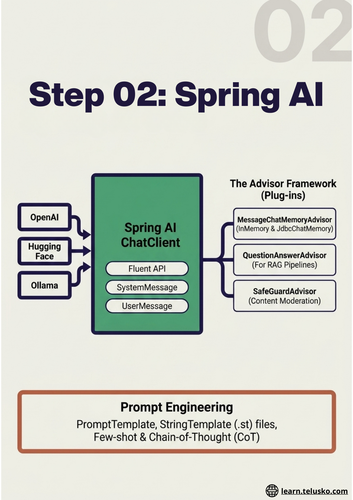
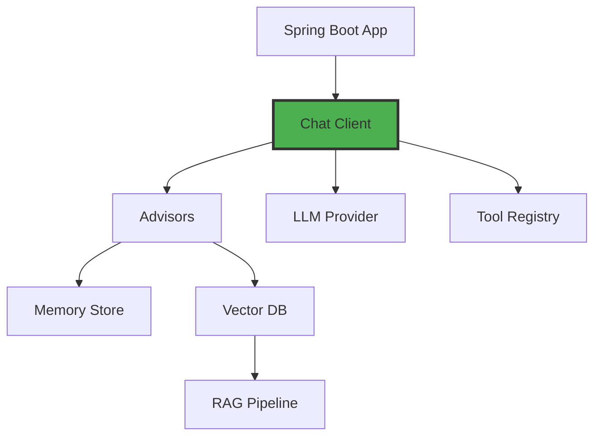

# Block 2: Spring AI Mastery

## Overview

Spring AI 2.0 brings the power of AI to the Spring ecosystem. This block covers everything from basic chat interactions to advanced RAG pipelines, multimodal AI, and production-ready deployment strategies.

## What You'll Learn

### Spring AI Introduction
- Why Spring AI for Java developers
- Spring AI 2.0 architecture overview
- Model providers: OpenAI, Anthropic, Azure, Ollama, Hugging Face
- Spring AI auto-configuration and starters

### Chat Client & Prompts
- Chat Model vs Chat Client: understanding the difference
- Message types: System, User, Assistant
- Chat Client fluent API deep dive
- Prompt Templates and template variables
- Multi-turn conversations

### Memory & Advisors
- Spring AI Advisors framework explained
- Message Chat Memory Advisor and Prompt Chat Memory Advisor
- InMemoryChatMemoryRepository
- JdbcChatMemoryAdvisor with database persistence
- Building Custom Advisors

### Vector Embeddings & Databases
- What are embeddings and vector spaces
- Embedding models in Spring AI
- PGVector Store setup and implementation
- Redis Vector Store configuration
- Cosine similarity and vector search

### RAG: Retrieval Augmented Generation
- What is RAG, and why does it work
- Basic RAG implementation in Spring AI
- Document Readers: PDF, Web, JSON, Markdown
- Document Transformers pipeline
- Advanced RAG with reranking and hybrid search
- Semantic caching for cost reduction

### Tool Calling & MCP
- Tool calling concepts and the ReAct pattern
- Defining and registering tools with @Tool
- Chained tool calls and multi-step reasoning
- Model Context Protocol (MCP) overview
- Building an MCP server in Java

### Multimodality
- Image generation with DALL-E 3
- Image understanding (Vision)
- Audio transcription with Whisper
- Text-to-Speech (TTS)

### Production Ready
- Fine-tuning with OpenAI API
- AWS SageMaker integration
- Streaming responses
- Model evaluation with Spring AI Evaluator API
- Monitoring with Grafana & Prometheus
- Observability and tracing

## Architecture

## Key Features

- ✅ Multiple LLM providers support
- ✅ Built-in memory management
- ✅ Vector database integrations
- ✅ RAG out of the box
- ✅ Tool calling with @Tool annotation
- ✅ Multimodal AI support
- ✅ Production-ready observability

## Duration

**Estimated Time:** 4-5 weeks

## Get Started

Dive into Spring AI and build production-ready AI applications!
