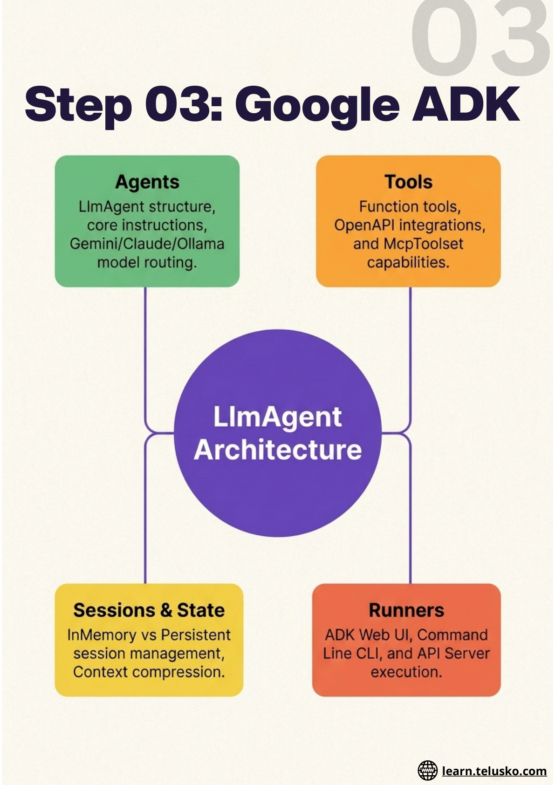
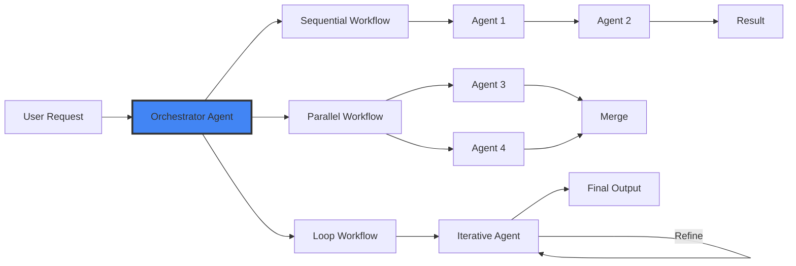

# Block 3: Google Agent Development Kit (ADK)

## Overview

Google's Agent Development Kit (ADK) provides a powerful framework for building autonomous agents with advanced orchestration capabilities. Learn to create single agents, workflow agents, and multi-agent systems.

## What You'll Learn

### ADK Introduction & Architecture
- What is Google ADK and why use it for Java
- ADK architecture: Agents, Tools, Sessions, Memory, Runner
- ADK for Java vs ADK for Python
- Setting up Google ADK in a Java project
- ADK Web UI, CLI, and API Server

### Building Your First Agent
- LlmAgent structure and configuration
- Writing agent instructions effectively
- Model selection: Gemini, Claude, Ollama
- AgentConfig: temperature, tokens, safety settings
- Running and testing your first ADK agent

### Tools & Function Calling
- Function tools in ADK: basics and setup
- Adding tools to LlmAgent
- OpenAPI tools integration
- Tool authentication and limitations
- MCP tools with ADK: McpToolset class

### Sessions, State & Memory
- Runner, Session, and State explained
- InMemorySessionService
- Persistent session management
- Adding memory to ADK agents
- Context management and compression

### Workflow Agents
- Sequential agents: chaining tasks in order
- Parallel agents: concurrent execution
- Loop agents: iterative task refinement
- Custom agents: building your own agent logic
- Agent routing and conditional flows
- Human-in-the-Loop (HITL) Workflows

### Multi-Agent Systems
- Multi-agent architecture overview
- Orchestrator and sub-agent patterns
- Agent-to-Agent (A2A) communication protocol
- A2A in Java: exposing and consuming agents
- Debugging and tracing multi-agent flows

### Advanced Features
- Callbacks: before and after model and tool execution
- Artifacts: managing files and binary outputs
- Guardrails and safety settings
- Grounding with Google Search and Vertex AI
- Observability: logging, metrics, and traces

### Deployment
- Deploying agents to Cloud Run using ADK command
- Deploying agents to GKE with Docker
- Production best practices for ADK agents

## Workflow Patterns

## Key Features

- ✅ Powerful agent orchestration
- ✅ Multiple workflow patterns
- ✅ Multi-agent systems
- ✅ A2A communication
- ✅ Human-in-the-loop support
- ✅ Cloud deployment ready
- ✅ Google Cloud integration

## Duration

**Estimated Time:** 2-3 weeks

## Get Started

Build sophisticated multi-agent systems with Google ADK!
