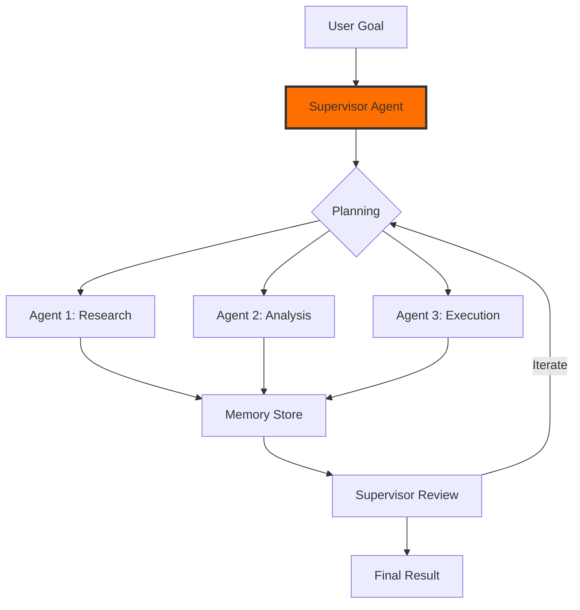

# Block 4: LangChain4j

## Overview

LangChain4j brings the popular LangChain framework to Java with a focus on agentic workflows, supervisor patterns, and peer-to-peer agent collaboration. Master autonomous AI systems that can plan, reason, and execute complex tasks.


## What You'll Learn

### LangChain4j Introduction
- What is LangChain4j and why use it
- LangChain4j vs Spring AI: when to pick which
- Setting up LangChain4j in Spring Boot
- Chat and Language Models low-level API
- Model parameters: temperature, top-p, timeouts

### AI Services & Memory
- AI Services and declarative interface with @AiService
- Chat Memory: MessageWindowChatMemory and TokenWindowChatMemory
- Conversation Memory and memory providers
- Streaming responses with TokenStream
- Structured Outputs in LangChain4j
- Text Classification with AI Services

### Tool Calling
- Tool calling concepts in LangChain4j
- @Tool and @P annotations
- Chained tool calls and multi-step reasoning
- Tool calling with AI Services
- Dynamic tool providers

### Model Context Protocol (MCP)
- MCP overview in LangChain4j context
- MCP client setup in LangChain4j
- Building a Java MCP stdio server
- Connecting MCP server to AI Services
- MCP + Tool Calling integration

### Agentic Workflows
- The langchain4j-agentic module overview
- @Agent annotation and Agentic Services
- Agentic Scope: shared state across agents
- Sequential workflow: chaining agents in order
- Loop workflow: iterative refinement with exit conditions
- Parallel workflow: running agents simultaneously
- Parallel Mapper workflow: fan-out over collections
- Conditional workflow: routing based on LLM classification
- Optional agents and async agents
- Streaming agents in agentic workflows

### Supervisor & Pure Agentic AI
- Pure agentic AI vs deterministic workflows
- Supervisor Agent: autonomous planning and execution
- Agent Invocation planning and response strategies
- Supervisor context and context engineering
- Goal-Oriented Agentic Pattern (GOAP)
- Peer-to-Peer (P2P) agentic pattern
- Building custom Planner implementations
- Memory and context sharing across agents

### RAG & Integration
- RAG with LangChain4j Embedding Store
- Document loaders in LangChain4j
- LangChain4j + PGVector / ChromaDB
- Integrating LangChain4j into Spring Boot app
- Testing and Evaluation of LangChain4j AI apps
- LangChain4j vs Spring AI RAG: comparison

### Advanced Features
- Guardrails: input and output validation
- Logging and Observability in LangChain4j
- Error handling and recovery in agentic systems
- Agent Listener and Agent Monitor for observability
- Human-in-the-loop agents
- Non-AI agents inside agentic systems
- Agent Monitor HTML report generation
- Strongly typed inputs and outputs with TypedKey

## Agentic Patterns



## Workflow Types

### Sequential Workflow
```java
@Agent
String researcher(String topic);

@Agent  
String analyzer(String research);

@Agent
String writer(String analysis);
```

### Parallel Workflow
```java
@Parallel
List<String> processAll(List<String> inputs);
```

### Supervisor Pattern
```java
@SupervisorAgent
Result autonomousPlanning(Goal goal);
```

## Key Features

- ✅ Declarative AI Services with annotations
- ✅ Multiple agentic workflow patterns
- ✅ Supervisor and P2P patterns
- ✅ Advanced memory management
- ✅ Built-in observability
- ✅ Human-in-the-loop support
- ✅ RAG integration
- ✅ MCP support

## Duration

**Estimated Time:** 2-3 weeks

## Get Started

Master autonomous agent systems with LangChain4j!
