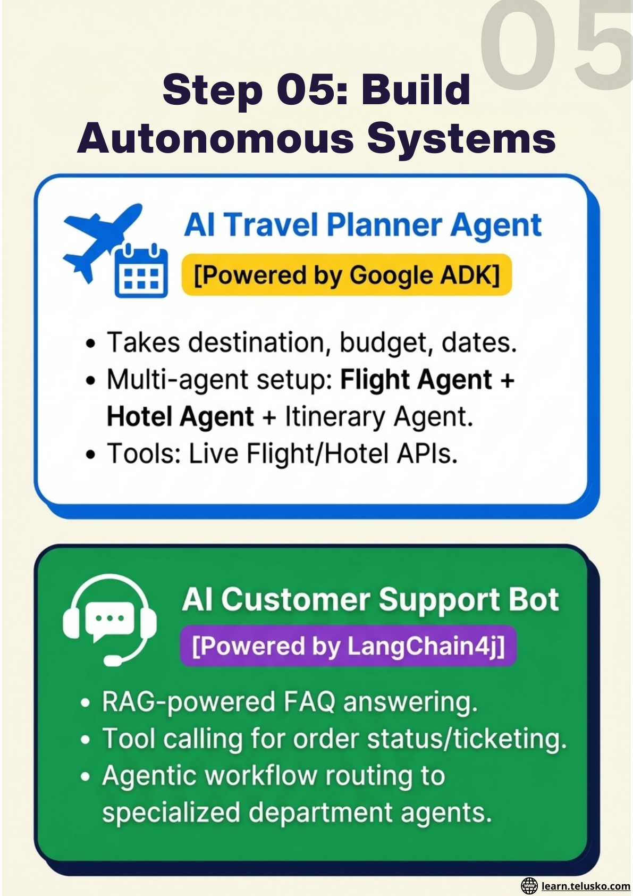
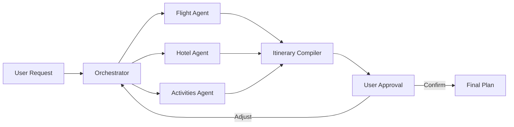
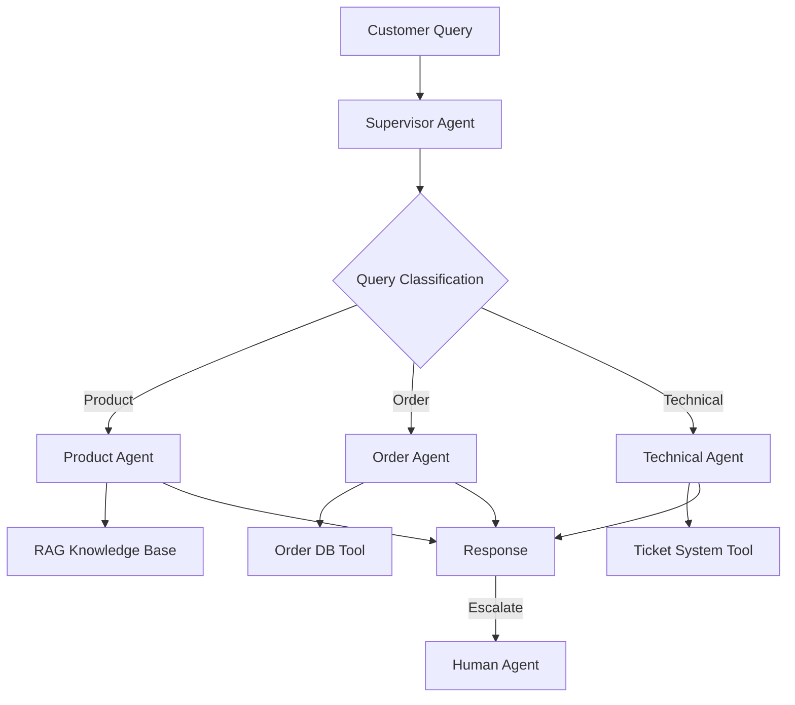
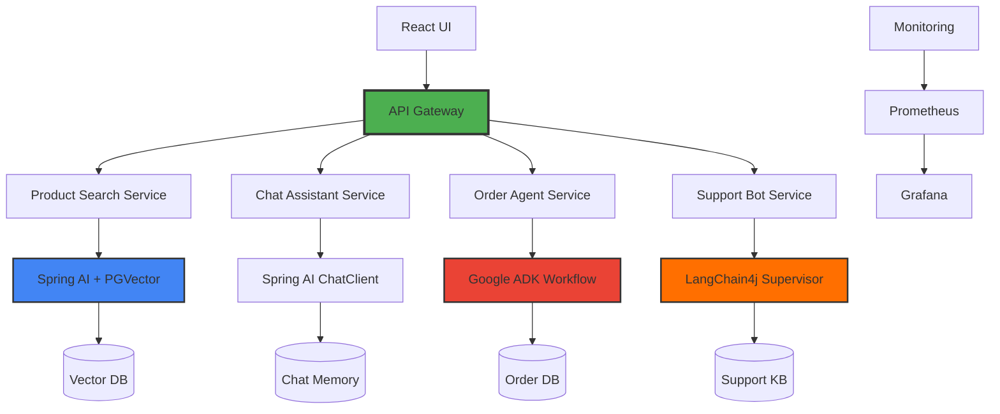

# Block 5: Capstone Projects

## Overview

Apply everything you've learned by building three complete, production-ready AI systems. Each project focuses on different aspects of agentic AI and uses different frameworks.

## Projects Overview

### Project 1: AI Travel Planner Agent
**Framework:** Google ADK  
**Duration:** 1-2 weeks

Build an intelligent travel planning agent that can help users plan complete trips.

#### Features
- Takes destination, budget, and dates as input
- Multi-agent architecture:
  - Flight Search Agent
  - Hotel Booking Agent
  - Attractions & Activities Agent
  - Itinerary Compiler Agent
- Tool integration for real-time data
- Workflow orchestration with Google ADK
- Human-in-the-loop for approval

#### Tech Stack
- Google ADK for agent orchestration
- Gemini LLM
- Flight/Hotel APIs
- Google Maps API

---

### Project 2: AI Customer Support Bot
**Framework:** LangChain4j  
**Duration:** 1-2 weeks

Create an intelligent customer support system with RAG, tool calling, and agentic workflows.

#### Features
- RAG-powered: answers from product documents and FAQs
- Conversation memory across sessions
- Tool calling to:
  - Check order status
  - Raise support tickets
  - Update customer information
- Agentic workflow: routes queries to appropriate department agents
- Sentiment analysis for escalation
- Human handoff when needed

#### Tech Stack
- LangChain4j for agentic workflows
- PGVector for RAG
- Supervisor pattern for routing
- Persistent memory store

---

### Project 3: E-Commerce AI Backend (Capstone)
**Framework:** Spring AI + Google ADK + LangChain4j  
**Duration:** 2-3 weeks

Build a complete e-commerce backend with multiple AI-powered features.

#### Features

**Frontend (React)**
- Product catalog with AI search
- Chat interface for product assistant
- AI-generated product images
- Voice search capability

**Backend AI Features**
1. **Smart Product Search**
   - Semantic search with PGVector
   - Vector embeddings of product catalog
   - Natural language queries
   
2. **Conversational Product Assistant**
   - Powered by Spring AI Chat Client
   - Memory across conversation
   - Product recommendations
   
3. **AI Image Generator**
   - DALL-E 3 integration
   - Generate product variations
   - Style transfer for products
   
4. **Order Management Agent**
   - Google ADK workflow agent
   - Order tracking and updates
   - Intelligent order routing
   
5. **Multi-Agent Support System**
   - LangChain4j supervisor pattern
   - Department-specific agents
   - Autonomous problem resolution

**Infrastructure**
- PGVector for semantic search
- Redis for caching
- PostgreSQL for data
- Grafana + Prometheus monitoring
- Docker containerization

#### Architecture

#### Implementation Phases

**Phase 1: Foundation (Week 1)**
- Set up Spring Boot project structure
- Configure databases (PostgreSQL, Redis, PGVector)
- Create basic REST APIs
- Set up React frontend skeleton

**Phase 2: AI Features (Week 2)**
- Implement semantic product search (Spring AI)
- Build chat assistant with memory
- Integrate DALL-E for image generation
- Create order management agent (Google ADK)

**Phase 3: Multi-Agent System (Week 3)**
- Build customer support bot (LangChain4j)
- Implement supervisor agent pattern
- Add tool calling for order/product operations
- Integrate all agents

**Phase 4: Production Ready (Week 4)**
- Add monitoring with Grafana/Prometheus
- Implement caching strategies
- Security and authentication
- Docker containerization
- Load testing and optimization

#### Learning Outcomes

After completing this project, you will:
- ✅ Integrate multiple AI frameworks in one application
- ✅ Build production-ready RAG systems
- ✅ Implement multi-agent architectures
- ✅ Handle real-world scalability challenges
- ✅ Monitor and observe AI applications
- ✅ Deploy containerized AI services

---

## Prerequisites

Before starting projects:
- Complete Blocks 1-4
- Comfortable with Spring Boot
- Basic React knowledge (for frontend)
- Docker familiarity
- Access to required API keys

## Evaluation Criteria

Each project will be evaluated on:
- **Functionality** (40%): Does it work as specified?
- **Code Quality** (20%): Clean, maintainable code?
- **AI Integration** (20%): Proper use of AI features?
- **User Experience** (10%): Intuitive and responsive?
- **Documentation** (10%): Clear README and comments?

## Submission

For each project, submit:
1. Complete source code (GitHub repository)
2. README with setup instructions
3. Architecture documentation
4. Demo video (3-5 minutes)
5. Challenges faced and solutions document

## Get Started

Choose your project and start building! Remember:
- Start small, iterate quickly
- Test each component thoroughly
- Document as you build
- Ask questions and seek feedback

Ready to build something amazing? Let's go! 🚀
